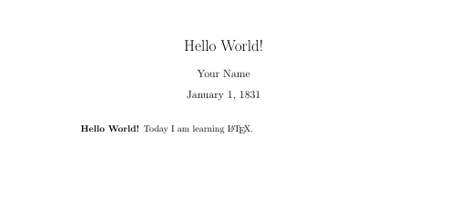
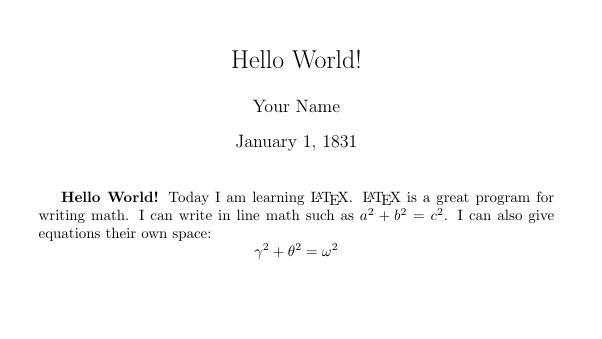
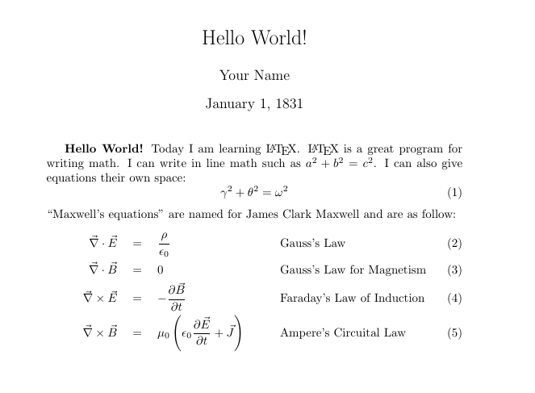
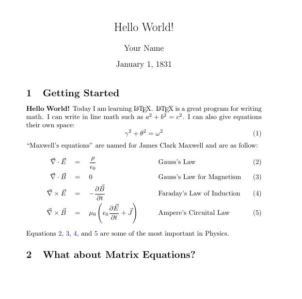
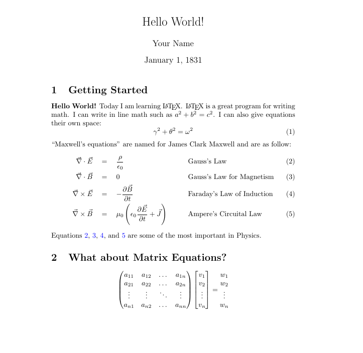
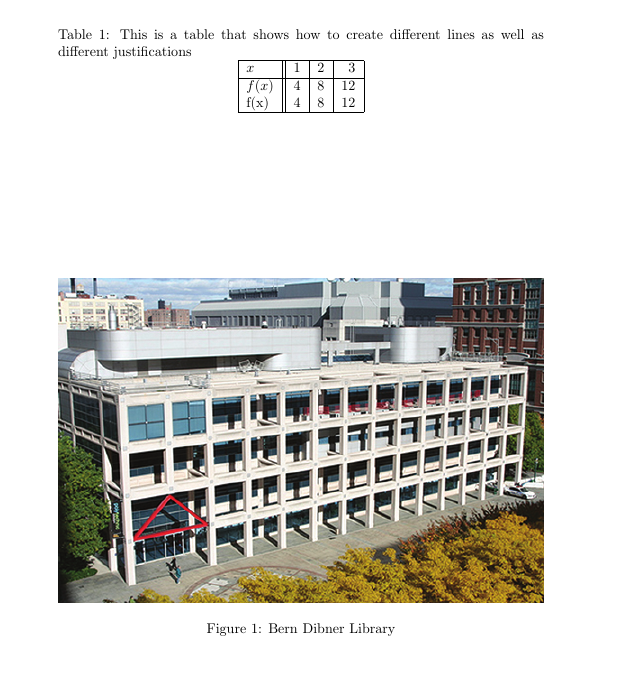
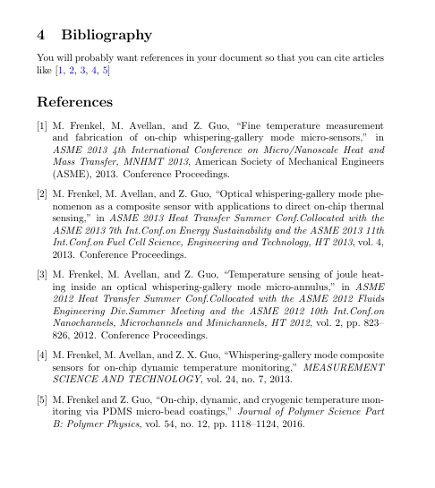

# Project 4: $$\LaTeX$$

This project consists of four parts. In Part 1, you will recreate a $$\LaTeX$$ document through a series of exercises. In Part 2, you will type up a current (or old assignment if not in another upper-division course current) that was handwritten. In Part 3, you will create a short Beamer slideshow on a mathematical topic of your choice. In part 4, you will record yourself giving the presentation from part 3. Various math faculty will watch the presentations and extra credit will be given to the top presentations.

The point are distributed as follows:

- Part 1: 15 points
- Part 2: 30 points
- Part 3: 35 points
- Part 4: 20 Points
- Bonus: Up to 10 points

## Submission

Each part should be done in a separate project titled `[lastname]-p[x]`, where `lastname` and `x` are specific to you and the part you are working on. For example, I would title Part 1 `tessler-p1`. Share your project with `cjtessler@seu.edu` using ShareLaTeX's sharing option by *Inviting named collabors*: [https://www.overleaf.com/learn/how-to/Sharing_a_project](https://www.overleaf.com/learn/how-to/Sharing_a_project)

## Part 1

Review the tutorial from class: [Learn $$\LaTeX$$ in 30 minutes](https://www.overleaf.com/learn/latex/Learn_LaTeX_in_30_minutes).
Cite this and any additional sources used to complete Part 1 in the bibliography (Exercise 7).

You can find hints and solutions to these exercises at [https://guides.nyu.edu/LaTeX/exercises](https://guides.nyu.edu/LaTeX/exercises). **Try the exercises and search the internet for general concepts before looking at hints or solutions.**

There are a few modifications to ensure the solutions are not copy and pasted. A submission that was copied and pasted will receive zero credit for part 1.

### Exercise 1

Create adocument with the title Hello World, your name, and today's date. Include in the document the following text: **Hello World!** Today I am learning $$\LaTeX$$. The solution should look like this (but with today's date):

### Exercise 2

Add to the document you created in exercise 1 the following text:

"$$\LaTeX$$ is a great program for writing math. I can write inline math such as $$a^2 + b^2 = c^2$$. I can also give equations their own space:

$$ \gamma^2 + \theta^2 = \omega^2 $$

The document should look like this:

### Exercise 3

In this exercise you will build onto the document created in exercises 1 and 2 with more complicated math and structures.  This is a much more difficult exercise so take your time.

First give the display environment equation from exercise 2 an equation number.  Second add the following line of text (make sure there it is not indented as a new paragraph:

"Maxwell's equations" are named for James Clark Maxwell and are as follow:

Now write Maxwell's equations (as seen below), use an align environment and align the equations at the = signs and at the equations names.

#### Exercise 3 Hints

- Did you include the amsmath package command, `\usepackage{amsmath}`?  Some symbols and advanced math environments such as align will not work with out it!
- The equation environment, `\begin{equation}`, automatically puts you in display mode and includes equations numbers.  If you want to use this mode but don't want equation numbers use equation*
- To create quotation marks in LaTeX use the symbol ` (the ~ key) twice on the left and use the ' key twice on the right.   Using " on the left and right will not work properly.
- In the align environment you use the `&` to denote points of alignment.  If you want a second alignment point use `&&`.
- If you are having trouble with spacing use around = use the command `\quad` this adds extra horizontal space.
- When adding text in math mode you need to use the command `\text{}` where the text you want added is the argument.  This command tells LaTeX to use regular text at that location.
- `\vec{}` will create vector notation. \partial will give you partial derivatives, and remember for fractions use `\frac{numerator}{denomonator}`.
- If you are having trouble getting your parenthesis to look right use the command `\left(` and `\right)` this will automatically fit the parenthesis to the equation within.  This also works with  `\left[`, `\left{`, and `\left|`, but you always need a `\right` to go with it.

### Exercise 4

Labels and reference are very simple to execute in LaTeX, can be used with any numbered object such as figures, equations, and sections, and are automatically updated whenever the document is complied.  If, for example, you realized you forgot an equation somewhere in the middle of your document, between 10 other equations, all the equations after the newly inserted equation would automatically be renumbered and proper references to them will reflect this new numbering!

For this exercise take the document made in the previous exercise and create two sections one at the beginning (Getting Started) and one after all your texts (What about Matrix Equations?).  Also add to your document references to each of Maxwell's Equations, and then write a sentence that references each equation.  You will need to use the commands `\label{}` and `\ref{}`.

It is common practice in LaTeX when labeling to use the format `eq:name`, `fig:name`, `tab:name`, and so on depending on the type of object you are labeling.

Also, if you would like your citations to act as hyperlinks you need to use the package hyperref, `\usepackage{hyperref}`, remember with this package you can change the default hyperlink settings with the command `\hypersetup{}` in the preamble i.e. `\hypersetup{colorlinks=true, linkcolor=blue, urlcolor=blue, citecolor=blue}`.

### Exercise 5

In this exercise add the matrix equation to your document as seen below:

### Exercise 6

For this exercise create a new section to your document for figures and tables.  In that section create a table and a figure different from the one below.  Give each object a caption, try putting the table caption above the table and the figure caption below.  Try this with a figure of your choice.

### Exercise 7

Read [https://www.overleaf.com/learn/latex/Bibliography_management_in_LaTeX](https://www.overleaf.com/learn/latex/Bibliography_management_in_LaTeX).

Create a BibTex file with a any references used for this part of the prject, at least one textbook, and your favorite fiction book. Add a sentance that contains these citations then add a bibliograph to your document. 

Here is an example:

## Part 2

Type up a current assignment from another upper-division math course being offered (Statistical Methods 1 or Abstract Algebra). If you are not currently in one of those courses, feel free to type up an assignment from a previous semester (Discrete Mathematics, Probability, etc).

The typed document must...

- be at least one page.
- include at least 3 problems using mathematical notation.
- include the problem and student solution.
- include a reference to the textbook in the bibliography.

Also, take a picture of all pages of the handwritten assignment and include that in your ShareLaTeX project.

Feel free to search the internet for different templates and ideas. E.g. [https://github.com/jdavis/latex-homework-template](https://github.com/jdavis/latex-homework-template)

## Part 3

Read the Beamer tutorial: [https://www.overleaf.com/learn/latex/Beamer](https://www.overleaf.com/learn/latex/Beamer).

Select a mathematical concept and create a short Beamer presentation (5-10 slides) covering a mathematical topic of your choice. It does not need to be specifically related to mathematical computing or computer science, but must be at least a concept explored in Calculus 1 or later.

Each student must choose a unique topic. This will be done on a first-come-first-serve basis. Sign your name and type a brief description of your selected topic in this Google Doc: [https://docs.google.com/document/d/1O7ZVRmYKZn9lYNoSnfGusxg7J6CVM6dIrU5IohGgWx8/edit?usp=sharing](https://docs.google.com/document/d/1O7ZVRmYKZn9lYNoSnfGusxg7J6CVM6dIrU5IohGgWx8/edit?usp=sharing).

While it is not required, you might find it interesting to explore and use the [TikZ package](https://www.overleaf.com/learn/latex/TikZ_package) to create one or two visuals for your presentation.

## Part 4

Record a video of yourself giving the presentation you created in Part 3 using screen recording software. If you are unsure how to do so, speak to me. The videos will be shared with various math faculty and extra credit will be given to the top presentations.

The Mathematics Department uses this [rubric](https://docs.google.com/document/d/1DohCOoOFHTKyxW1dMZMJ4ZtTe8lcA7Q6/edit?usp=sharing&ouid=113422212862769860234&rtpof=true&sd=true) to grade presentations.
